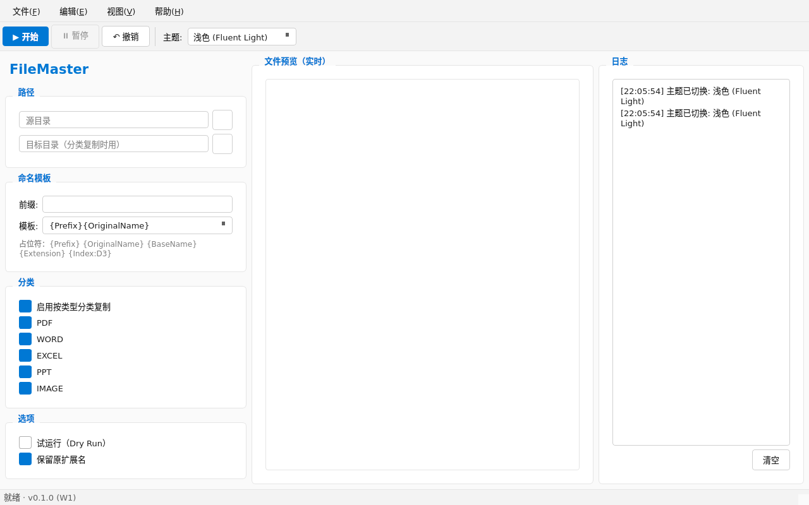
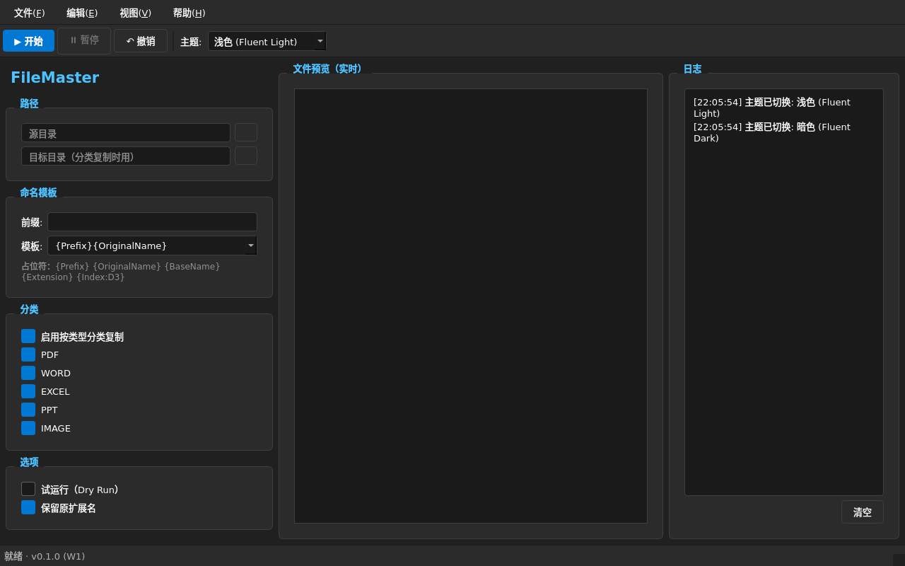
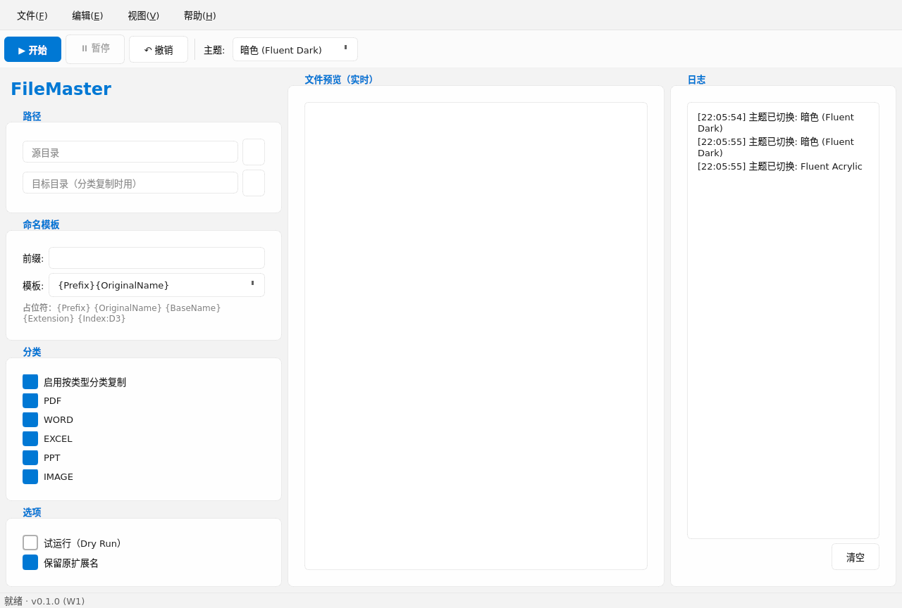
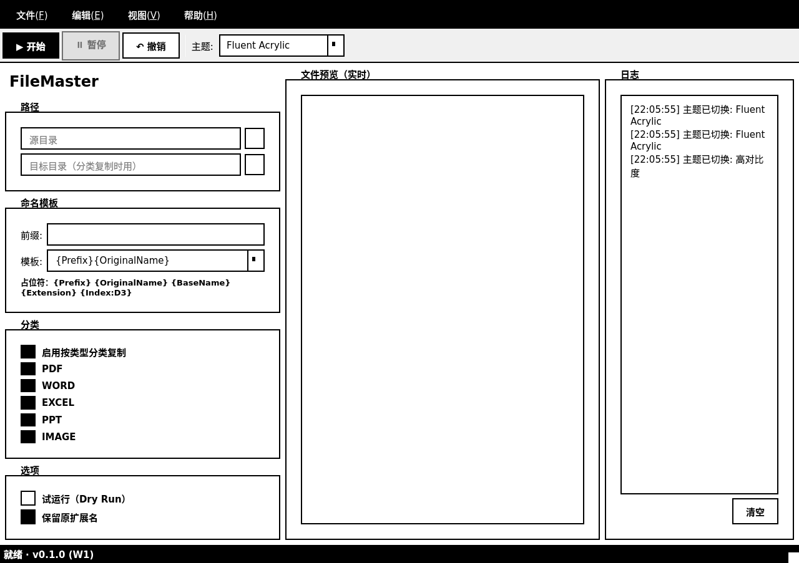

# FileMaster

> 跨平台文件批量重命名 + 分类 + 元数据提取 + 去重 + 撤销 工具（Windows/macOS/Linux）
> Python 3.10+ · PySide6 6.5+ · 单文件 exe 仅 ~30 MB

## 主题预览

| Light (Fluent) | Dark (Fluent) | Fluent (亚克力) | High Contrast |
| :---: | :---: | :---: | :---: |
|  |  |  |  |

## 5 分钟上手

```bash
# 1. 克隆
git clone https://github.com/Chris566/FileMaster
cd FileMaster

# 2. 安装
pip install -e ".[dev]"

# 3. 跑测试（381+ 用例）
pytest tests/unit/ --cov=src/filemaster

# 4. 启动 GUI
python -m filemaster
# 或纯 CLI
python -m filemaster.cli rename --help
python -m filemaster.cli dedup-scan --help
python -m filemaster.cli dedup-action --help
python -m filemaster.cli dedup-undo --help

# 5. 打包成单文件 exe（无需管理员权限）
pip install -e ".[build]"
pyinstaller build/filemaster.spec --clean --noconfirm
# 产物：dist/filemaster.exe
```

## 核心功能

### 重命名（W1-W2 + W5）— 引擎收尾

**占位符引擎**（W1-W2 通用 + W5 命名空间）：
- **通用**：`{Prefix}` / `{OriginalName}` / `{BaseName}` / `{Extension}` / `{Index:D3}` / `{Date}` / `{Title}` / `{Author}`
- **W5 命名空间**（按文件类型 lazy load，未用到不读文件）：
  - **PDF**：`{pdf_title}` `{pdf_author}` `{pdf_subject}` `{pdf_pages}` `{pdf_created}` `{pdf_modified}`
  - **Word**：`{word_title}` `{word_author}` `{word_subject}` `{word_paragraphs}` `{word_created}` `{word_modified}`
  - **Excel**：`{excel_title}` `{excel_author}` `{excel_subject}` `{excel_sheets}` `{excel_sheet_name}` `{excel_created}` `{excel_modified}`
  - **Image**：`{image_width}` `{image_height}` `{image_taken_at}` `{image_camera_make}` `{image_camera_model}` `{image_format}` `{image_aspect_ratio}`（16:9 / 4:3 / 1:1 / 3:2 / 21:9 / 5:4 / 2:3 / 9:16，2% 容差）

**CLI 实战**（W5 完整集成）：

```bash
# 基础：按模板重命名（带 ASCII 进度条 + 3 种冲突策略）
python -m filemaster.cli rename -s <dir> -t "{Index:D3}_{OriginalName}" -p "img_"

# 跳过/覆盖/重命名 冲突策略
python -m filemaster.cli rename -s <dir> -t "{Index:D3}_{OriginalName}" --conflict skip
python -m filemaster.cli rename -s <dir> -t "{Index:D3}_{OriginalName}" --conflict overwrite
python -m filemaster.cli rename -s <dir> -t "{Index:D3}_{OriginalName}" --conflict rename_new

# 单文件精确定位（避开 dir scan）
python -m filemaster.cli rename -s <file> -t "{pdf_title}_{OriginalName}"

# 命名空间占位符 (按文件类型提取 metadata)
python -m filemaster.cli rename -s <dir> -t "{pdf_title}_{pdf_pages}p_{OriginalName}"
python -m filemaster.cli rename -s <dir> -t "{image_aspect_ratio}_{OriginalName}"  # 例: 16_9_img.png

# Dry-run (只规划不执行) + JSON 输出 (供脚本消费)
python -m filemaster.cli rename -s <dir> -t "{Index:D3}_{OriginalName}" --dry-run --json
```

**W5 引擎细节**：
- `apply_with_progress(on_progress)` — 逐文件回调，进度条统一接口
- 冲突策略：`skip`（目标存在则跳过）/ `overwrite`（覆盖，旧值进 undo 栈）/ `rename_new`（自动加 `(1)` `(2)` ...）
- 跨平台 atomic overwrite（`os.replace`，Windows 目标存在不抛 FileExistsError）
- 进度回调异常内部 `contextlib.suppress` 吞掉，不影响主流程

### 异步 rename + GUI 进度条（W6）— 用户感知升级

**BatchWorker 重构**：把 W5 引擎能力 `apply_with_progress(on_progress)` 真正接进 GUI 主流程。

- `workers/batch.py` — `BatchWorker.run()` 用 `apply_with_progress` 替代手动 `apply([single_file])` 循环
  - 保持 `self._index` 连续性（不破坏现有 undo 栈与 Index 占位符）
  - 复用 W5 进度回调基础设施（内部 `contextlib.suppress` 吞回调异常）
- **ETA 估算** — 用前 5 个文件耗时滑动窗口算 ETA，进度消息始终展示 `i/t (pct) ETA Ns`（即使 ETA=0s 仍展示，增强用户进度感）
- **取消语义局限**（W7+ 解决） — `apply_with_progress` 不响应 `_cancelled` 标志，cancel 按钮只能等当前文件完成

**GUI 进度条升级**（`ui/main_window.py`）：
- 进度条文本从裸 percent 升级到 `文件名 · 3/10 (30%) ETA 5s`
- 每文件结果带状态图标写到右侧可见日志面板（之前只写隐藏的 `_list_files`）：

```
✅ [    OK     ] 001_doc.txt → 001_report.txt
⚠️ [ CONFLICT ] 002_doc.txt → 002_report.txt  (target exists, skipped)
⏭ [ SKIPPED  ] 003_doc.txt → 003_report.txt
❌ [   ERROR  ] 004_doc.txt → read permission denied
```

- 状态映射：`OK/RENAMED/OVERWRITTEN/DRY_RUN` → ✅ · `CONFLICT` → ⚠️ · `SKIPPED` → ⏭ · 其他 → ❌

**Tests** — 6 个新单测（`tests/unit/test_batch.py`）：
- `test_basic_run_emits_per_file` — 流式 `file_done` 信号
- `test_progress_message_has_eta` — 进度消息含 ETA 段
- `test_empty_files` — 空文件列表不崩
- `test_with_undo_stack` — UndoStack `deque[list[UndoEntry]]` 正确填充
- `test_worker_does_not_crash_on_run` — 普通异常不挂
- `test_failed_handler_does_not_crash` — failed 信号兜底

**累计**：381 单测通过 / 0 失败 / 5 跳过（Windows-only）/ ruff clean。

### 协作式 cancellation token（W7）— 取消按钮真正生效

**解决 W6 已知局限**：`apply_with_progress` 不响应 `_cancelled` 标志，cancel 按钮只能等当前文件完成。

**CancellationToken**（`core/cancellation.py`）：
- 状态对象（`is_cancelled` property + `cancel()` 幂等 + `reset()` 复用）
- 主线程调 `cancel()`，worker 线程读 `is_cancelled`
- 不绑线程 / 事件循环，可用于 GUI / CLI / 测试任何场景

**`apply_with_progress(is_cancelled)`**（`core/renamer.py`）：
- 在 for 循环顶部（文件之间）检查 `is_cancelled()`，不打断单文件处理
- 已收集的 `results` 仍返回，已写入的 `undo entries` 仍入栈
- **`is_cancelled=None`（默认）= W5/W6 行为完全不变**，backward compat

```python
from filemaster.core.cancellation import CancellationToken
from filemaster.core.renamer import Renamer

token = CancellationToken()
# 主线程: cancel 按钮触发后
token.cancel()
# worker 线程: apply_with_progress 内自动检查
renamer.apply_with_progress(
    files, on_progress=cb,
    is_cancelled=token.is_cancelled,  # 注意是 property, 不是方法
)
```

**BatchWorker 集成**（`workers/batch.py`）：
- `_cancelled: bool` → `_token: CancellationToken`（W6 → W7 重构）
- `cancel()` 内部调 `token.cancel()`
- `run()` 传 `is_cancelled=lambda: self._token.is_cancelled` 给引擎
- **新增 `cancelled(int)` 信号**：取消时发已处理文件数（让 UI 知道处理了多少）
- 暴露 `cancellation_token` property（状态查询 / 测试断言）

**UI 集成**（`ui/main_window.py`）：
- 接 `cancelled` 信号 → `_on_cancelled(processed_count)` handler
- 日志面板输出 `⏹ 已取消 · 已处理 N 个文件, 剩余未处理`
- 状态栏同步显示 `已取消 · 已处理 N 个文件`
- cancel 按钮在 `_on_finished` 统一重置（避免重复 click 状态机）

**Tests** — 8 个新单测：
- `apply_with_progress` 取消（5 个）：立即停 / 中段停 / undo 只入已处理 / 预取消 0 处理 / backward compat
- `BatchWorker` 取消（3 个）：run 中取消触发 cancelled 信号 / 预取消 0 文件 / token property 状态

**累计**：389 单测通过 / 0 失败 / 5 跳过（Windows-only）/ ruff clean。

### CancellationToken 推广到所有 Worker（W8）— 全 worker 统一取消契约

把 W7 的 `CancellationToken` 模式从 BatchWorker 推广到剩下 3 个 worker，形成**统一的取消契约**：

- **`DedupWorker`**（扫描）：`_cancel_requested: bool` → `_token: CancellationToken`，在 hash 之间检查取消，发 `cancelled(processed)` 信号
- **`DedupActionWorker`**（move/delete/hardlink）：同样改造，在文件动作之间检查取消
- **`PreviewWorker`**（单文件预览）：同样改造，但发 `cancelled()` 无参信号（单文件 IO 没有"已处理 N 个"概念）

**`cancelled` 信号契约**：
- 批处理 worker（BatchWorker / DedupWorker / DedupActionWorker）→ `Signal(int)`（已处理文件数）
- 单文件 worker（PreviewWorker）→ `Signal()`（无参）
- 三个 worker 都暴露 `cancellation_token` property 供外部状态查询
- 三个 worker 的 `cancel()` 内部都调 `self._token.cancel()`

**UI 集成**（`ui/main_window.py`）：
- `_on_dedup_cancelled(processed_count)` / `_on_dedup_action_cancelled(processed_count)` / `_on_preview_cancelled()`
- 日志 + 状态栏 + 摘要标签同步刷新 `⏹ 已取消 · 已处理 N 个文件, 剩余未处理`
- thread 清理统一在 `_on_*_finished` 收尾（避免两个 handler 改同一按钮状态的竞态）

**Tests** — 7 个新单测：
- DedupWorker 取消（3 个）：cancel_before_run / cancel_during_run（monkey-patch 减速 file_hash）/ token property
- DedupActionWorker 取消（3 个）：cancel_before_run / cancel_during_run（monkey-patch 减速 _run_single）/ token property
- PreviewWorker 取消（2 个）：cancel_before_run（emit cancelled() 无参）/ token property

**累计**：405 单测通过 / 0 失败 / 5 跳过（Windows-only）/ ruff clean。

### 硬中断 safe_rename（W9）— 取消按钮秒级响应

W7+W8 的协作式取消解决了"文件之间能停"的问题，但单文件 `os.replace` 本身是原子的、不可中断。处理大文件时（GB 级视频/镜像），用户点取消后还要等几秒，体感差。W9 引入 **safe_rename**：把单文件操作拆成可中断的两步，源文件始终在可控状态。

**两阶段 rename**：
- **Step A**：`shutil.move(src, src+".filemaster.tmp.<8hex>")` — 同卷是 rename (瞬时)，跨卷是 copy+delete
- **中断检查点**：调用 `is_cancelled()` — 返回 True 时 `shutil.move(tmp, src)` 回滚
- **Step B**：`os.replace(tmp, dst)` — 原子覆盖（不可中断，但同卷极快微秒级）

**核心 API**（`core/safe_rename.py`）：

```python
from filemaster.core.safe_rename import safe_rename, SafeRenameResult

result: SafeRenameResult = safe_rename(
    src, dst,
    is_cancelled=lambda: token.is_cancelled,  # 可选
)
# result.status: "OK" | "ROLLBACK" | "ERROR"
# result.source / result.target / result.message
```

**状态语义**：
- `OK` — 成功，dst 已是新文件（可入 UndoStack）
- `ROLLBACK` — 取消，src 仍在原位（**不入 UndoStack**——没真完成 rename）
- `ERROR` — 失败，src 可能已动，残留 .tmp 需 cleanup_orphan_tmps

**临时文件命名**：`.filemaster.tmp.<8hex>` — 8 字符 md5(ino + mtime_ns + size)，避免长名撞 Windows MAX_PATH 260

**集成点**：
- `_apply_one` 改用 `safe_rename` 替代直接 `os.replace`
- `apply` 入口调用 `_cleanup_tmps(files)` 清理残留（应对崩溃/杀进程场景）
- `file_hash` 加 `is_cancelled` 参数，每块读取后检查（GB 文件可中断）— 抛 `HashCancelledError(InterruptedError)`

**W7+W8+W9 三层取消契约**：
- W7：文件循环顶部检查（文件之间）
- W8：所有 worker 统一暴露 `cancellation_token` property
- W9：单文件 `safe_rename` Step A 后内部检查（**单文件之内**）

**孤儿清理**（`find_orphan_tmps` / `cleanup_orphan_tmps`）：
- 递归扫描子目录
- worker 启动 + apply 入口各调一次
- 处理崩溃/kill -9 场景的残留

**Tests** — 18 个新单测：
- `test_safe_rename.py` — 18 个：make_tmp_path (4) / safe_rename normal (4) / cancel rollback (3) / errors (2) / orphan tmps (5)
- `test_renamer.py` — 6 个：apply_with_progress rollback (4) / apply entry cleanup (2)
- `test_batch.py` — 2 个：hard cancel keeps source (1) / normal no orphan (1)
- `test_hash.py` — 3 个：is_cancelled 行为（None / always False / immediate raise）

**累计**：431 单测通过 / 0 失败 / 5 跳过（Windows-only）/ ruff clean。

**其他**：
- **分类器** — 内置 5 类（PDF / WORD / EXCEL / PPT / IMAGE）+ 自定义扩展
- **元数据** — PDF (PyMuPDF) / Word (python-docx) / Excel (openpyxl) / Image (EXIF)
- **预览** — 前 N 文件元数据快照

### 归档 Archive（W10）— zip / tar.gz / tar.bz2

W1 写了 `core/archiver.py` 骨架但没接任何能力，W10 把它做成完整模块：3 种格式 + 进度 + 取消 + 撤销。

**核心 API**（`core/archiver.py`，~260 行）：

```python
from filemaster.core.archiver import ArchiveFormat, Archiver

archiver = Archiver()

# 1) 单卷: 进度 + 取消 + 原子写入 (W9 safe_rename 协作)
result: ArchiveResult = archiver.archive_with_progress(
    files, Path("backup.zip"),
    fmt=ArchiveFormat.ZIP, compression=6,
    on_progress=lambda i, t, f, b: print(f"{i}/{t} {f.name}"),
    is_cancelled=lambda: token.is_cancelled,
)
# result.status: "OK" | "CANCELLED" | "ERROR"

# 2) 按内置分类分卷: 自动生成 IMAGE.zip / DOCUMENT.zip / ...
results: dict[str, ArchiveResult] = archiver.archive_by_category(
    files, output_dir, fmt=ArchiveFormat.TAR_GZ,
    on_progress=lambda cat, i, t, f, b: ...,
    is_cancelled=lambda: ...,
)
```

**写入策略**（W9 集成）：

```
原文件源目录
   ↓ shutil / zip / tar 写入到
.archive_path.filemaster.tmp.<8hex>    ← 取消时 unlink
   ↓ safe_rename (Step A + check + Step B)
最终 .archive_path                        ← 原子覆盖
```

**ArchiveFormat enum**：

| 格式 | 扩展名 | mode 参数 | compresslevel |
|---|---|---|---|
| `ZIP` | `.zip` | `ZIP_DEFLATED` | 0-9 (0=STORE) |
| `TAR_GZ` | `.tar.gz` | `w:gz` | 1-9 |
| `TAR_BZ2` | `.tar.bz2` | `w:bz2` | 1-9 |

**Worker**（`workers/archiver.py`，~160 行）— `ArchiveWorker(QObject + QThread)` 模式：

- 5 个信号：`progressed(percent, file, i, t, msg)` / `archive_done(ArchiveResult)` / `cancelled(int)` / `finished(list)` / `failed(name, err)`
- 与 `BatchWorker` 一致暴露 `cancellation_token` property
- 单卷 / 按 category 双模式（`by_category=True` 走 `archive_by_category`）
- 成功后写 UndoStack：`UndoEntry(operation="Archive", target=archive_path)`
- 启动时 `cleanup_archive_tmps(output_dir)` 处理上次崩溃残留

**CLI** — `archive` 子命令：

```bash
# 单卷 zip
filemaster archive -s ./data -o ./backups -n project_2026

# tar.gz
filemaster archive -s ./data -o ./backups -n project_2026 --format tar.gz

# 按类分卷 (递归子目录)
filemaster archive -s ./data -o ./backups --by-category -r

# JSON 管道
filemaster archive -s ./data -o ./backups -n x --json
```

**撤销集成**（`core/undo.py`）：

- `OperationType` Literal 加 `"Archive"` 选项
- `UndoEntry(operation="Archive", target=archive_path)` 记录归档文件
- 撤销 = 删除归档文件即可（撤销 dispatcher 待 W11 接入）

**Tests** — 51 个新单测：

- `test_archiver.py` — 34 个：ArchiveFormat enum (7) / Dataclasses (3) / archive 基础 3 格式 (5) / archive_with_progress (10, 含 3 种取消时序: pre-start / midway / during-write) / archive_by_category (4) / cleanup_archive_tmps (3) / safe_rename 协作 (2)
- `test_archive_worker.py` — 10 个：单卷信号 (4) / 按 category (2) / 取消 (2) / 失败 (1) / 基础 (1)
- `test_cli.py::TestArchiveCLI` — 7 个：dry-run JSON / 真实 zip / tar.gz / tar.bz2 / 源不存在 / by-category / --json

**累计**：486 单测通过 / 0 失败 / 5 跳过（Windows-only）/ ruff clean。

### 去重 Dedup（W3-W4）— 完整闭环


四阶段流水线：扫描 → 预览 → 动作 → 撤销。

```bash
# 1. 扫描：按哈希分组重复文件
python -m filemaster.cli dedup-scan <目录> --hash md5

# 2. 预览：看哪几个文件是同组（不实际操作）
python -m filemaster.cli dedup-scan <目录> --hash sha256 --preview 5

# 3. 执行：选一种动作策略
python -m filemaster.cli dedup-action <目录> --strategy move_subdir  # 移到 .duplicates/
python -m filemaster.cli dedup-action <目录> --strategy hardlink     # 硬链接去重
python -m filemaster.cli dedup-action <目录> --strategy skip         # 跳过重复
python -m filemaster.cli dedup-action <目录> --strategy delete        # 慎用

# 4. 撤销：每一步动作都写 undo log，事后可恢复
python -m filemaster.cli dedup-undo list                           # 列出 ~/.filemaster/undo/*.json
python -m filemaster.cli dedup-undo restore --log <log-file>       # 恢复 move 操作副本
```

**支持哈希**：`md5` / `sha1` / `sha256` / `blake2b`（按文件大小可任选；SHA256 是平衡速度和碰撞率的推荐值）。

**动作策略**：
- `skip` — 检测到重复就跳过，不动文件
- `move_subdir` — 把重复文件移到 `<目录>/.duplicates/`（原文件留原位）
- `hardlink` — 用硬链接去重，节省磁盘
- `delete` — 直接删重复文件（**不可撤销**，warn 一行提示）

**撤销栈（Undo）**：
- 所有 `move` / `hardlink` / `delete` 动作都先写一条 JSON 日志到 `~/.filemaster/undo/<timestamp>.json`
- 日志含 `op_type` / `timestamp` / `source_path` / `dest_path` / `original_size` / `original_mtime` / `hash_value` / `hash_algo`
- 损坏的 JSON 自动跳过（list 时不抛错）
- `restore` 只恢复 `move` 操作（`delete` 没数据可恢复，`hardlink` 撤销会产生临时副本）— 故意不开放 delete 撤销

**GUI 集成**：
- 主窗口 "去重" 页加 "扫描" → "预览" → "执行" 三个按钮 + 进度条 + 结果列表
- "↶ 撤销" 按钮（主窗口）打开 `DedupUndoDialog`：QListWidget 列出所有 undo log + 复选框选要恢复的 + 状态输出
- 10 个 GUI 单测覆盖按钮触发、对话框开关、勾选逻辑、恢复流程（TestDedupUndoButton + TestDedupUndoDialog）

### 其他

- **撤销栈** — 50 步环形缓冲 + JSON 持久化（重命名用，跟 Dedup 撤销是两条独立栈）
- **Excel 报告** — 7 列 + 冻结表头 + 自动筛选
- **4 套主题** — light / dark / fluent / high_contrast（QSS）
- **配置持久化** — 跨平台 `%APPDATA%` / `~/Library` / `$XDG_CONFIG_HOME`

## 项目状态

| 周次 | 目标 | 状态 | 备注 |
|------|------|------|------|
| **W1** | 项目脚手架 + 4 主题 + 测试框架 | ✅ 完成（66 测试） | 主题截图 + PyInstaller spec |
| **W2** | 重命名引擎 + 6 占位符 + 异步 UI | ✅ 完成 | 异步扫描 + 进度回调 |
| **W3** | 元数据提取（PDF/Word/Excel/Image） | ✅ 完成（+21 test） | 6 个 placeholder 接入 metadata |
| **W4** | Dedup 完整闭环（扫描/动作/Undo 恢复+GUI） | ✅ 完成（329 测试） | MD5/SHA1/SHA256/BLAKE2b · 4 动作策略 · GUI 集成 |
| **W5** | 重命名收尾 + 4 套 namespace placeholder + CLI 真集成 | ✅ 完成（375 测试） | PDF/Word/Excel/Image 命名空间 · apply_with_progress · 单文件源 |
| **W6** | BatchWorker 重构 + GUI 进度条升级 + ETA 估算 | ✅ 完成（381 测试） | apply_with_progress 集成 · ETA 滑动窗口 · ✅⚠️⏭❌ 状态图标 · 同步到可见日志面板 |
| **W7** | apply_with_progress 协作式取消 (CancellationToken) | ✅ 完成（389 测试） | core/cancellation.py · 取消即生效 · cancelled(n) 信号 · undo 只入已处理 |
| **W8** | CancellationToken 推广到 Dedup / Preview Worker | ✅ 完成（405 测试） | 全 worker 统一取消契约 · 7 个新单测（dedup × 6 + preview × 2 − 1 共享 helper）· monkey-patch 减速模式 |
| **W9** | 硬中断 safe_rename (单文件两步可中断) | ✅ 完成（431 测试） | 拆分 os.replace 为 Step A + 检查 + Step B · 源文件始终可控 · .filemaster.tmp.<8hex> 临时文件 · 29 个新单测（safe_rename 18 + renamer 6 + batch 2 + hash 3）|
| **W10** | 归档 archive (zip / tar.gz / tar.bz2) | ✅ 完成（486 测试） | 3 种格式 · 进度 + 取消 + 原子写入 · UndoStack 集成 · CLI 子命令 · 51 个新单测 |
| W11-W13 | 飞书集成 + 右键菜单注册 | 🔜 | |
| W14-W15 | 打包优化 + 自动更新 | 🔜 | |
| W16 | v1.0 发布 | 🔜 | |

**当前累计**：405 单测通过 / 0 失败 / 5 跳过 · 跨平台 3 OS × 3 Python CI 全绿 · Windows 全链路冒烟通过。

## 16 周路线图

详见 `docs/roadmap.md`（W1 阶段暂未生成，W2 起建立）。

## 贡献指南

```bash
# Lint
ruff check src/ tests/

# Type check
mypy src/filemaster

# Coverage
pytest tests/unit/ --cov=src/filemaster --cov-report=html
```

CI 跑通：`.github/workflows/test.yml`（3 OS × 3 Python 测试矩阵）+ `windows-smoke.yml`（Windows 打包冒烟测试）+ `build.yml`（发布 .exe）。

## 许可证

MIT
